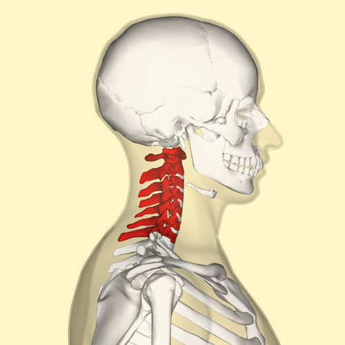

# 颈椎：   
> 颈椎（cervical vertebrae）是脊椎的第一节。人类的颈椎位于颈部区域，一共有7块颈椎骨。  

  

---

## 颈椎病症状表现：  
1. 由于颈部交感神经受到刺激或压迫, 会表现为头痛、头晕或头皮痛、眩晕等，可伴有恶心、呕吐,视物不清楚、模糊,视力下降等复杂的表现。
2. 颈枕部或颈肩部疼痛或麻痹,在夜间颈肩部及上肢可能会加剧。

## 诱因及预防：  
### 诱因：  
1. 退化：随着身体机能老化，椎体间关节长期过度受力、椎间盘的水分流失导致弹性降低，维持颈椎肩的稳定性下降，及椎间盘承受压力的能力减少，这些自然的退化现象，都是引起颈椎疾病之主要原因。
2. 慢性劳损：长期低头看书、使用电脑、坐姿不正、斜躺在床上看书、睡觉长期垫又高又硬的枕头，导致**颈椎违反自然的角度**，引起颈部肌肉韧带与椎间盘疲劳过度而产生颈椎间盘突出及颈椎骨质增生等颈椎疾病。
### 预防：  

// TODO  

## 治疗：  
//  TODO   

## 参考资料：
[颈椎病-百度百科](https://baike.baidu.com/item/%E9%A2%88%E6%A4%8E%E7%97%85)

